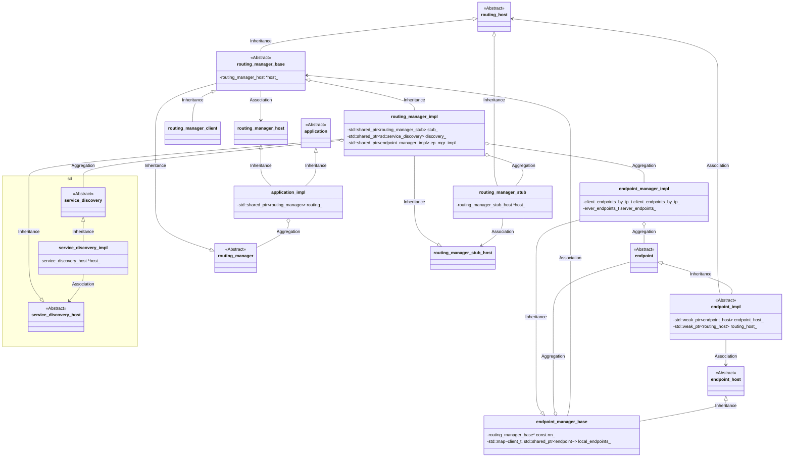

## 整体框架


## 各模块之间的关系



**vsomeip**对于各个模块定义了**xxx_host**类，**xxx_host**类并不是该模块的基类，**xxx_host**类是其他模块的基类。该模块可通过指向**xxx_host**的指针，访问其他模块。例如：sd模块中有`service_discovery_host`类，而`service_discovery_host`是`routing_manager_impl`的基类。`service_discovery_impl`类中有以下成员变量

```c++
service_discovery_host *host_
```

然后`service_discovery_impl`可以通过此指针访问`routing_manager_impl`类。

## Host和Proxy模式

在用户调用了`application::init()`函数后，**vsomeip**会执行一下部分代码：

```c++
std::string its_routing_host = its_configuration->get_routing_host_name();
if (its_routing_host != "") {
    is_routing_manager_host_ = (its_routing_host == name_);
    if (is_routing_manager_host_ &&
            !utility::is_routing_manager(configuration_->get_network())) {
#ifndef VSOMEIP_ENABLE_MULTIPLE_ROUTING_MANAGERS
        VSOMEIP_ERROR << "application: " << name_ << " configured as "
                "routing but other routing manager present. Won't "
                "instantiate routing";
        is_routing_manager_host_ = false;
        return false;
#else
    is_routing_manager_host_ = true;
#endif // VSOMEIP_ENABLE_MULTIPLE_ROUTING_MANAGERS
    }
} else {
    auto its_routing_address = its_configuration->get_routing_host_address();
    auto its_routing_port = its_configuration->get_routing_host_port();
    if (its_routing_address.is_unspecified()
            || is_local_endpoint(its_routing_address, its_routing_port))
        is_routing_manager_host_ = utility::is_routing_manager(configuration_->get_network());
}
```

**vsomeip**会根据配置文件中**routing**字段是否是本次运行的**app name**（**app name**可以通过环境变量**VSOMEIP_APPLICATION_NAME**设置），选择启用**Host**模式还是**Proxy**模式。而**Host**和**Proxy**实际上只是创建的`routing_manger`类不同。

```c++
if (is_routing_manager_host_) {
    VSOMEIP_INFO << "Instantiating routing manager [Host].";
    if (client_ == VSOMEIP_CLIENT_UNSET) {
        client_ = static_cast<client_t>(
                  (configuration_->get_diagnosis_address() << 8)
                & configuration_->get_diagnosis_mask());
        utility::request_client_id(configuration_, name_, client_);
    }
    routing_ = std::make_shared<routing_manager_impl>(this);
} else {
    VSOMEIP_INFO << "Instantiating routing manager [Proxy].";
    routing_ = std::make_shared<routing_manager_client>(this, client_side_logging_, client_side_logging_filter_);
}
```

对于**Host**模式，创建`routing_manager_impl`类，对于**Proxy**模式，创建`routing_manager_client`类。在`routing_manager_client`类中并没有创建sd模块，也没有endpoint manager模块。那么**Proxy**模式下，如何实现**someip**的各个功能呢？

在`routing_manager_client`创建两个本地**UDS**通信的**endpoint**，一个用于发送，一个用于接受。如下所示：

```c++
std::shared_ptr<endpoint> sender_;  // --> stub
std::shared_ptr<endpoint> receiver_;  // --> from everybody
```

```c++
sender_ = ep_mgr_->create_local(VSOMEIP_ROUTING_CLIENT);
...
receiver_ = ep_mgr_->create_local_server(shared_from_this());
```

这两个对象会与`routing_manager_stub`类进行通信。而`routing_manager_stub`类的对象会在`routing_manager_impl`类中创建。如下：

```c++
std::shared_ptr<routing_manager_stub> stub_;
stub_ = std::make_shared<routing_manager_stub>(this, configuration_);
```

## Proxy模式下Event分析

### event订阅

#### 注册订阅

在`routing_manager_client`类，无论是请求订阅，还是提供订阅，都是调用`routing_manager_client::register_event`来实现的。`routing_manager_client::register_event`的函数声明如下：

```c++
virtual void register_event(client_t _client,
        service_t _service, instance_t _instance,
        event_t _notifier,
        const std::set<eventgroup_t> &_eventgroups,
        const event_type_e _type, reliability_type_e _reliability,
        std::chrono::milliseconds _cycle, bool _change_resets_cycle,
        bool _update_on_change, epsilon_change_func_t _epsilon_change_func,
        bool _is_provided, bool _is_shadow = false,
        bool _is_cache_placeholder = false)
```

可通过`_is_provided`来区分是请求订阅还是提供订阅。

`register_event`函数最后会调用`routing_manager_client::send_register_event`发送订阅。

`send_register_event`的函数声明如下：

```c++
void send_register_event(client_t _client,
        service_t _service, instance_t _instance,
        event_t _notifier,
        const std::set<eventgroup_t> &_eventgroups,
        const event_type_e _type, reliability_type_e _reliability,
        bool _is_provided, bool _is_cyclic)
```

`send_register_event`最终会调用`sender_->send(&its_buffer[0], uint32_t(its_buffer.size()))`将event的订阅消息发送给本机上在**Host**模式下运行的**vsomeip**应用。

**Host**模式下运行的**vsomeip**应用会在`routing_manager_stub`类的`on_message`函数中收到此event的订阅消息，并进行相应的处理，代码如下：

```c++
case protocol::id_e::REGISTER_EVENT_ID:
{
    protocol::register_events_command its_command;
    its_command.deserialize(its_buffer, its_error);
    if (its_error == protocol::error_e::ERROR_OK) {

        its_client = its_command.get_client();
        for(std::size_t i = 0; i < its_command.get_num_registrations(); i++) {
            protocol::register_event register_event;
            if (!its_command.get_registration_at(i, register_event)) {
                continue;
            }

            its_service = register_event.get_service();
            its_instance = register_event.get_instance();

            if (register_event.is_provided()
                    && !configuration_->is_offered_remote(its_service, its_instance)) {
                continue;
            }

            host_->register_shadow_event(its_client,
                    its_service, its_instance,
                    register_event.get_event(), register_event.get_eventgroups(),
                    register_event.get_event_type(), register_event.get_reliability(),
                    register_event.is_provided(), register_event.is_cyclic());

            ...
        }


    } else
        VSOMEIP_ERROR << __func__ << ": register event deserialization failed ("
                << std::dec << static_cast<int>(its_error) << ")";
    break;
}
```

可以看到最终调用了`host_->register_shadow_event`函数，`host_`是指向`routing_manager_impl`的指针，实际上就是调用的`routing_manager_impl::register_shadow_event`函数。而`routing_manager_impl::register_shadow_event`最终会调用`routing_manager_base::register_event`函数。

#### 客户端请求订阅

如果是请求订阅，则还需要调用`routing_manager_client::subscribe`函数，声明如下：

```c++
void subscribe(client_t _client, const vsomeip_sec_client_t *_sec_client,
        service_t _service, instance_t _instance,
        eventgroup_t _eventgroup, major_version_t _major,
        event_t _event, const std::shared_ptr<debounce_filter_impl_t> &_filter)
```

`routing_manager_client::subscribe`会调用`routing_manager_client::send_subscribe`将消息发送出去。`routing_manager_client::send_subscribe`声明如下：

```c++
void send_subscribe(client_t _client,
        service_t _service, instance_t _instance,
        eventgroup_t _eventgroup, major_version_t _major,
        event_t _event, const std::shared_ptr<debounce_filter_impl_t> &_filter)
```

同样的，**Host**模式下运行的**vsomeip**应用会在`routing_manager_stub`类的`on_message`函数中收到此event的subscribe消息，并进行相应的处理，代码如下：

```c++
case protocol::id_e::SUBSCRIBE_ID:
{
    protocol::subscribe_command its_command;
    its_command.deserialize(its_buffer, its_error);
    if (its_error == protocol::error_e::ERROR_OK) {

        its_client = its_command.get_client();
        its_service = its_command.get_service();
        its_instance = its_command.get_instance();
        its_eventgroup = its_command.get_eventgroup();
        its_major = its_command.get_major();
        its_notifier = its_command.get_event();
        auto its_filter = its_command.get_filter();

        if (its_notifier == ANY_EVENT) {
            if (host_->is_subscribe_to_any_event_allowed(_sec_client, its_client, its_service,
                    its_instance, its_eventgroup)) {
                host_->subscribe(its_client, _sec_client, its_service, its_instance,
                        its_eventgroup, its_major, its_notifier, its_filter);
            } else {
                VSOMEIP_WARNING << "vSomeIP Security: Client 0x" << std::hex << its_client
                        << " :  routing_manager_stub::on_message: "
                        << " subscribes to service/instance/event "
                        << its_service << "/" << its_instance << "/ANY_EVENT"
                        << " which violates the security policy ~> Skip subscribe!";
            }
        } else {
            if (VSOMEIP_SEC_OK == security::is_client_allowed_to_access_member(
                    _sec_client, its_service, its_instance, its_notifier)) {
                host_->subscribe(its_client, _sec_client, its_service, its_instance,
                        its_eventgroup, its_major, its_notifier, its_filter);
            } else {
                VSOMEIP_WARNING << "vSomeIP Security: Client 0x" << std::hex << its_client
                        << " :  routing_manager_stub::on_message: "
                        << " subscribes to service/instance/event "
                        << its_service << "/" << its_instance << "/" << its_notifier
                        << " which violates the security policy ~> Skip subscribe!";
            }
        }
    } else
        VSOMEIP_ERROR << __func__
            << ": deserializing subscribe failed ("
            << std::dec << static_cast<int>(its_error) << ")";
    break;
}
```

最终调用了`host_->subscribe`函数。而`host_->subscribe`实际上就是`routing_manager_impl::subscribe`，这样就和**Host**模式xAI的subscribe的处理流程一样了。

#### 客户端处理subscribeack

**Host**模式下运行的**vsomeip**应用收到了subscribeack消息后，会进行判断：

```c++
void routing_manager_impl::on_subscribe_ack(client_t _client,
        service_t _service, instance_t _instance, eventgroup_t _eventgroup,
        event_t _event, remote_subscription_id_t _id) {
				
  			...

        for (const auto &its_subscriber : subscribed_clients) {
            if (its_subscriber == get_client()) {
                if (_event == ANY_EVENT) {
                    for (const auto &its_event : its_eventgroup->get_events()) {
                        host_->on_subscription_status(_service, _instance,
                                _eventgroup, its_event->get_event(),
                                0x0 /*OK*/);
                    }
                } else {
                    host_->on_subscription_status(_service, _instance,
                            _eventgroup, _event, 0x0 /*OK*/);
                }
            } else if (stub_) {
                stub_->send_subscribe_ack(its_subscriber, _service,
                        _instance, _eventgroup, _event);
            }
        }
     }
}
```

当client id不是本app的client id的时候，会通过`routing_manager_stub::send_subscribe_ack`将ack消息发送出去。

`routing_manager_stub::send_subscribe_ack`的声明如下：

```c++
void send_subscribe_ack(client_t _client, service_t _service,
        instance_t _instance, eventgroup_t _eventgroup, event_t _event)
```

在`send_subscribe_ack`的函数，会将subscribe_ack消息返回。

**Proxy**模式下，`routing_manager_client`首先会在`routing_manager_client::on_message`函数对收到的subscribe_ack进行处理。`routing_manager_client::on_message`的声明如下：

```c++
void on_message(const byte_t *_data, length_t _size, endpoint *_receiver,
        bool _is_multicast,
        client_t _bound_client, const vsomeip_sec_client_t *_sec_client,
        const boost::asio::ip::address &_remote_address,
        std::uint16_t _remote_port)
```

处理的代码片段如下：

```c++
    case protocol::id_e::SUBSCRIBE_ACK_ID:
    {
        protocol::subscribe_ack_command its_subscribe_ack;
        its_subscribe_ack.deserialize(its_buffer,  its_error);
        if (its_error == protocol::error_e::ERROR_OK) {

            its_service = its_subscribe_ack.get_service();
            its_instance = its_subscribe_ack.get_instance();
            its_eventgroup = its_subscribe_ack.get_eventgroup();
            its_subscriber = its_subscribe_ack.get_subscriber();
            its_event = its_subscribe_ack.get_event();

            on_subscribe_ack(its_subscriber, its_service, its_instance, its_eventgroup, its_event);
            VSOMEIP_INFO << "SUBSCRIBE ACK("
                << std::hex << std::setfill('0')
                << std::setw(4) << its_client << "): ["
                << std::setw(4) << its_service << "."
                << std::setw(4) << its_instance << "."
                << std::setw(4) << its_eventgroup << "."
                << std::setw(4) << its_event << "]";
        } else
            VSOMEIP_ERROR << __func__
                << ": subscribe ack command deserialization failed ("
                << std::dec << static_cast<int>(its_error) << ")";
        break;
    }
```

可以看到最后又`routing_manager_client::on_subscribe_ack`进行了处理。

## Host模式下Event分析

### 服务端提供订阅


#### Application层

1. 首先创建并初始化application，然后调用`application_impl->register_message_handler`注册事件field相关的set和get方法。
2. 调用`application_impl->offer_event`向外提供对应的event或field。
3. 调用`application_impl->offer_service`向外提供对应的服务实例。
4. 调用`application_impl->start`启动函数。

#### RoutingManger层

在`application_impl->offer_event`内，会调用`routing_manager_impl->register_event`函数注册对应的event(注：在此过程中，register_event(... bool is_provided...)_中`is_provided`会赋值为true，**注意与客户端请求event对比**)

```c++
routing_->register_event(client_,_service, _instance,
       _notifier, _eventgroups, _type, _reliability,
       _cycle, _change_resets_cycle, _update_on_change,
       _epsilon_change_func, true);

//该函数原型
void routing_manager_impl::register_event(vsomeip_v3::client_t _client, vsomeip_v3::service_t _service, 							vsomeip_v3::instance_t _instance, vsomeip_v3::event_t _notifier,
                       const std::set<...> &_eventgroups, vsomeip_v3::event_type_e _type, 					vsomeip_v3::reliability_type_e _reliability, std::chrono::milliseconds _cycle, 					bool _change_resets_cycle, bool _update_on_change, 										vsomeip_v3::epsilon_change_func_t _epsilon_change_func, bool _is_provided, 					bool _is_shadow = false, bool _is_cache_placeholder = false)
 
 //相关变量赋为：
    _cycle std::chrono::milliseconds::zero()
    _change_resets_cycle false
    _update_on_change true
    _epsilon_change_func nullptr
    _is_provided = true
    bool _is_shadow = false, bool _is_cache_placeholder = false
```

具体`routing_manager_impl::register_event`函数调用运行如下：

- 首先会调用在`routing_manager_impl::events_`容器中查找是否为首次注册，若是，则调用`routing_manager_base::register_event`进行注册

  - 对于event的传输(reliability)是udp还是tcp或其他，优先以配置文件为准；配置文件若为`RT_UNKNOWN`类型，则以调用该注册函数传参为准；若传参仍为`RT_UNKNOWN`，则以服务的reliability为准。

  - 再次在`routing_manager_base::events_`容器中查找，**若event已存在且不是缓存占位符**，且类型与注册的相同(或已注册的类型为`ET_UNKNOWN`)，则更新event相关参数，同时将其添加到指定的eventgroups中(调用`application_impl->offer_event`时传入的eventgroups)，`transfer_subscriptions_from_any_event`变量为true;

  - **若已存在且是缓存占位符**，则根据传参赋值，若event不是field类型<!--event类型有：ET_EVENT、ET_SELECTIVE_EVENT、ET_FIELD、ET_UNKNOWN-->，则不预设payload值。若eventgroup为空，则初始化一个插入：

    ```c++
    if (_type != event_type_e::ET_FIELD) {
        // don't cache payload for non-fields
        its_event->unset_payload(true);
    }
    if (_eventgroups.size() == 0) { // No eventgroup specified
        std::set<eventgroup_t> its_eventgroups;
        its_eventgroups.insert(_notifier);
        its_event->set_eventgroups(its_eventgroups);
    }
    ```

    **若不存在**，则根据传参创建一个event(**这部分中间`if ((_is_shadow || is_routing_manager()) && !_epsilon_change_func)`分支作用未懂**)

  - 若之前设置`transfer_subscriptions_from_any_event=true`或`_is_provided=true`，将从`ANY_EVENT`转移订阅到创建的event

  - 遍历传入的eventgroups容器，在`routing_manager_base::eventgroups_`容器中查找eventgroups中每个eventgroup，若不存在，则根据传参创建一个eventgroup存入`routing_manager_base::eventgroups_`容器中。然后向对应的eventgroup添加event信息(**注：之前是向创建的`event`类中添加对应的eventgroup，现在是向`routing_manager_base::eventgroups_`容器中添加对应的event**)

  - 最后向`routing_manager_base::events_`容器中添加对应的event

### 客户端请求订阅


#### Application层

1. 首先创建并初始化application，然后调用`application_impl->register_message_handler`注册相关method。


2. 调用`application_impl->request_event`向外请求对应的event或field

3. 调用`application_impl->subscribe`向外订阅event获field

4. 调用`application_impl->request_service`请求服务

5. 调用`application_impl->start`启动函数

#### RoutingManger层

在`application_impl->request_event`中

直接调用`routing_manager_impl->register_event`函数注册event(**注意与服务端对比，区别在于**`_is_provided`变量为false)：

```c++
routing_->register_event(client_,_service, _instance,
       _event, _eventgroups, _type, _reliability,
       std::chrono::milliseconds::zero(), false, true,
       nullptr,
       false);
```

针对请求的event注册，此处不在赘述。

在`application_impl->subscribe`中，该函数声明为：

```c++
void vsomeip_v3::application::subscribe(vsomeip_v3::service_t _service, 
     vsomeip_v3::instance_t _instance, vsomeip_v3::eventgroup_t _eventgroup, 			            vsomeip_v3::major_version_t _major = (vsomeip_v3::major_version_t)0U, 
     vsomeip_v3::event_t _event = (vsomeip_v3::event_t)65535U)
```

**注：**`_event`传参默认值为(vsomeip_v3::event_t)65535U，代表为`ANY_EVENT`

- 使能了`routing_`则会调用`application_impl::check_send_back_cached_event`

  - 该函数内，会在`application_impl::subscriptions_`map容器中查找对应的`[_service][_instance][_event][_eventgroup]`键值对是否存在：若不存在`subscriptions_[_service][_instance][_event][_eventgroup]=false`；若存在且对应的值为true，则进一步判断，更改传入的bool指针值：

    ```c++
    if(_event == ANY_EVENT) {
        *_send_back_cached_eventgroup = true;
    } else {
        *_send_back_cached_event = true;
    }
    ```

  - 后续会依据这些判断调用对应的函数：

    ```c++
    if (send_back_cached) {
        send_back_cached_event(_service, _instance, _event);
    } else if(send_back_cached_group) {
        send_back_cached_eventgroup(_service, _instance, _eventgroup);
    }
    ```

    这种实际上并不会向外发布subscribe消息。

  - 之后调用`application_impl::check_subscription_state`函数：
    该函数内，首先在`application_impl::subscription_state_`容器内查找对应的`[_service][_instance][_eventgroup][_event]`键值对是否存在：若存在,则进一步根据订阅状态做判断：

    ```c++
    if (its_event->second != subscription_state_e::SUBSCRIPTION_NOT_ACKNOWLEDGED) {
        has_found = true;
    
        should_subscribe = false;
        if (its_event->second == subscription_state_e::SUBSCRIPTION_ACKNOWLEDGED) {
            is_acknowledged = true;
        }
    }
    ```

    若不存在，就改变对应的订阅状态为`IS_SUBSCRIBING`：

    ```c++
    if (!has_found) {
        subscription_state_[_service][_instance][_eventgroup][_event]
            = subscription_state_e::IS_SUBSCRIBING;
    }
    ```

    同时传递订阅状态

    > [!CAUTION]
    >
    > (**该函数代码过长，未搞清楚**)
    >
    > ```c++
    > if (!should_subscribe && is_acknowledged) {
    > deliver_subscription_state(_service, _instance, _eventgroup, _event, 0 /* OK */);
    > }
    > ```

    最后返回`should_subscribe`是否需要订阅。

  - 若上一步的返回值为true，则调用`routing_manager_impl::subscribe`进行订阅。

至此，`application_impl->subscribe`函数结束。

在`routing_manager_impl::subscribe`函数中：

1. ```c++
   --->rm_impl::find_local_client(_service, _instance);
   	--->......
           --->rm_base::find_local_client_unlocked(_service, _instance);
   ```

   最后会在`routing_manager_impl::local_services_`中查找对应的服务、实例的client

2. 若查找返回的client与`routing_manager_base::client_`相同

   > [!CAUTION]
   >
   > **应该是判断为本地routing manager自身提供的服务，具体的流程暂未深究**

3. 若不相同，则准备调用sd模块发送

   1. ```c++
      insert_subscription(_service, _instance, _eventgroup,_event, _filter, _client, 			&its_already_subscribed_events);
      ```

      1. 若传参`_event != ANY_EVENT`，则调用`routing_manager_base::find_event(_service, _instance, _event)`查找对应的event，然后添加订阅者：

         ```c++
         is_inserted = its_event->add_subscriber(_eventgroup, _filter, _client,
         	host_->is_routing());
         ```

         并返回结果`is_inserted`。

         > [!CAUTION]
         >
         > 若没有查找到对应的event，则：
         >
         > ```c++
         > is_inserted = create_placeholder_event_and_subscribe(_service,
         >   _instance, _eventgroup, _event, _filter, _client);
         > ```
         >
         > 然后返回结果`is_inserted`。**该函数暂未搞清楚**,应该是创建占位符

      2. 若传参`_event == ANY_EVENT`，则调用`routing_manager_base::find_eventgroup(_service, _instance, _eventgroup)`在对应的`routing_manager_base::eventgroups_`查找对应的eventgroup，然后从对应的eventgroup中读取events，遍历每个event，添加订阅者：

         ```c++
         is_inserted = e->add_subscriber(_eventgroup, _filter, _client,
                 host_->is_routing()) || is_inserted;
         ```

         同时，若event已被_client订阅(通过其他事件组订阅)，则将对应event插入`_already_subscribed_events`容器中。

         > [!CAUTION]
         >
         > 若没有找到对应的eventgroup或者eventgroup中没有event，则：
         >
         > ```c++
         > is_inserted = create_placeholder_event_and_subscribe(_service,
         >   _instance, _eventgroup, _event, _filter, _client);
         > ```
         >
         > 然后返回结果`is_inserted`。

   2. 若之前在`routing_manager_impl::local_services_`中查找对应的服务、实例的client=0，则

      ```c++
      handle_subscription_state(_client, _service, _instance, _eventgroup, _event);
      static const ttl_t configured_ttl(configuration_->get_sd_ttl());
      notify_one_current_value(_client, _service, _instance,
                                  _eventgroup, _event, its_already_subscribed_events);
      ```

      若在`routing_manager_base::eventgroups_`容器中查找到对应eventgroup信息，且(订阅者不是host或者在`routing_manager_base::services_`容器中查找到对应服务，则通过`service_discovery_impl::subscribe`发送订阅
      若在`routing_manager_impl::local_services_`中查找对应的服务、实例的client不为0，则通过`stub_->send_subscribe`发送订阅信息

   3. 订阅者若是host，则将订阅信息插入`routing_manager_base::pending_subscriptions_`容器

至此，`routing_manager_impl::subscribe`函数结束。

### event的发送

首先在app层面调用notify后，如下：

```c++
app_ = vsomeip::runtime::get()->create_application()
app_->notify(SAMPLE_SERVICE_ID, SAMPLE_INSTANCE_ID,SAMPLE_EVENT_ID, payload_);
```

notify函数原型为：

```c++
//源码的interface目录内的application.hpp文件内声明
virtual void notify(service_t _service, instance_t _instance,
        event_t _event, std::shared_ptr<payload> _payload,
        bool _force = false) const = 0;
```

`application_impl->notify`最终会调用`routing_manager_base->notify`函数，在`routing_manager_base::events_`容器中查找对应的event，然后调用对应event的`event->set_payload`函数发送

```c++
event->set_payload{
	-->notify
    -->if (change_resets_cycle_)
    	   start_cycle();
}
```

在```void event::notify(bool _force)```函数中，会调用`routing_->send(VSOMEIP_ROUTING_CLIENT, update_, _force)`函数发送notify报文，同时`start_cycle`函数开启循环发送的定时器。

下面针对send具体讲解，最终会调用`routing_manager_impl::send`函数：

```c++
bool routing_manager_impl::send(client_t _client, const byte_t *_data,
        length_t _size, instance_t _instance, bool _reliable,
        client_t _bound_client, const vsomeip_sec_client_t *_sec_client,
        uint8_t _status_check, bool _sent_from_remote, bool _force) 
```

函数内会进行一系列检查，针对notification报文，会依据传入的服务、实例、method找到对应的event，然后依据event找到对应的所有eventgroups，然后依据eventgroup中的subscriptions_容器内的订阅信息获取每个订阅者信息，然后发送。

### 服务端event的处理


启动后，服务端会一直通过多播向外发送offerservice。客户端也会发送find多播报文或者subscribe报文。收到的消息经由以下函数处理：

```c++
--->routing_manager_impl::on_message(const byte_t *_data, length_t _size,......)
    /...code.../
	--->service_discoery_impl::on_message(const byte_t *_data, length_t _length,......)
    	 /...code.../
    	--->service_discoery_impl::process_eventgroupentry(its_eventgroup_entry,...,its_acknowledgement,...)
    	/...code.../ //解析报文处理结果并进一步处理，应答或忽略
    /...code.../
    --->routing_manager_impl::on_message(service_t _service, instance_t _instance,......)//非sd报文由该函数处理
//end
```

在`service_discoery_impl::process_eventgroupentry`函数解析，函数原型如下：

```c++
void service_discovery_impl::process_eventgroupentry(
        std::shared_ptr<eventgroupentry_impl> &_entry,
        const std::vector<std::shared_ptr<option_impl> > &_options,
        std::shared_ptr<remote_subscription_ack> &_acknowledgement,
        const boost::asio::ip::address &_sender,
        bool _is_multicast,
        bool _is_stop_subscribe_subscribe, bool _force_initial_events,
        const sd_acceptance_state_t& _sd_ac_state)
```

在`service_discoery_impl::handle_eventgroup_subscription`函数中：

- 解析entry信息，通过层层调用`routing_manager_base::find_eventgroup`函数查找`eventgroups_`容器内是否有相关信息,若没有记录：

  - 且entry类型为`SUBSCRIBE_EVENTGROUP`以及该entry的ttl大于0，那么就设置ttl为0，向`_acknowledgement`插入订阅nack报文
  - 若不是`SUBSCRIBE_EVENTGROUP`，就调用`service_discovery_impl::unsubscribe`函数在`subscribed_`容器中查找，然后解除订阅并发送message消息

  做完以上，直接return返回

- 检查entry对应的报文的`return_code`

- 对于entry类型为`SUBSCRIBE_EVENTGROUP`报文，会对其地址、entry字段的option数量、等等字段长度做检查，如有问题会报错直接返回或回复一个nack。

- 对entry内提及的option数量是否与options数量对应，若options数量少于entry内说的，会报错并回复nack，然后直接返回

- 之后会检查每个options的类型，调用sd_impl模块的`check_layer_four_protocol`函数检查ip是否正确，并随之根据options内提及的端口信息配置`its_first_address`、`its_second_address`等局部变量（注：针对option类型为：`CONFIGURATION`，会不做任何处理）

- 最后会依据具体的类型，转交给sd_impl模块的`handle_eventgroup_subscription`函数处理，`SUBSCRIBE_EVENTGROUP_ACK`转交给sd_impl模块的`handle_eventgroup_subscription_ack`函数或`handle_eventgroup_subscription_nack`函数。

针对`SUBSCRIBE_EVENTGROUP`调用`handle_eventgroup_subscription`函数处理，该函数原型为：

```c++
void service_discovery_impl::handle_eventgroup_subscription(
        service_t _service, instance_t _instance,
        eventgroup_t _eventgroup, major_version_t _major,
        ttl_t _ttl, uint8_t _counter, uint16_t _reserved,
        const boost::asio::ip::address &_first_address, uint16_t _first_port,
        bool _is_first_reliable,
        const boost::asio::ip::address &_second_address, uint16_t _second_port,
        bool _is_second_reliable,
        std::shared_ptr<remote_subscription_ack> &_acknowledgement,
        bool _is_stop_subscribe_subscribe, bool _force_initial_events,
        const std::set<client_t> &_clients,
        const sd_acceptance_state_t& _sd_ac_state,
        const std::shared_ptr<eventgroupinfo>& _info)
```

在`service_discovery_impl::handle_eventgroup_subscription`函数中：

1. 判断`_entry`字段的版本信息与自己提供的是否一致

2. 创建订阅者的端口，判断端口是`udp multicast`、`tcp unicast`还是`udp unicast`

3. 依据订阅者的端口信息，创建`remote_subscription`类型指针并赋值，

4. 若`_ttl`=0，且`_is_stop_subscribe_subscribe`=false(`_is_stop_subscribe_subscribe`变量在`sd_impl->on_message`函数中通过`check_stop_subscribe_subscribe`函数赋值，若ttl=0、且entry为停止订阅类型、且message中后续的entries又有请求订阅的entry，则该变量为true),会向容器`pending_remote_subscriptions_`中添加ack：

   ```c++
   pending_remote_subscriptions_[its_subscription] = _acknowledgement;
   host_->on_remote_unsubscribe(its_subscription);
   ```

   然后返回。

5. 后续会进行`_force_initial_events`判断

6. 最后会如同ttl=0操作一样插入`_acknowledgement`变量，然后调用`rm_impl->on_remote_subscribe`函数：

   ```c++
   host_->on_remote_subscribe(its_subscription,
                   std::bind(&service_discovery_impl::update_remote_subscription,
                             shared_from_this(), std::placeholders::_1));
   ```

   1. 在`on_remote_subscribe`函数中，依据ttl和现在时间计算失效时间，更新订阅信息，刷新订阅时间。

   2. 调用`eventgroupinfo::update_remote_subscription`函数更新订阅信息，若不是一个新订阅，且是个重复订阅，没有改变，则直接调用回调函数`sd_impl->update_remote_subscription`，然后函数运行结束，**该分支过多，暂未弄清**。

      至此，`rm_impl::on_remote_subscribe`结束

至此，`process_eventgroupentry`函数处理完毕

处理完报文中每个entry后，针对eventgroupentry处理的结果`its_acknowledgement`，会调用`update_acknowledgement`与`send_subscription_ack`函数处理和发送。其中，在`update_acknowledgement`函数内，也是会调用`send_subscription_ack`函数发送结果，而在`send_subscription_ack`函数内，调用`update_subscription_expiration_timer`函数更新定时器，具体为：

- 首先更新订阅过期时间
- 调用`start_subscription_expiration_timer_unlocked`函数：
  - 该函数会延时`next_subscription_expiration_`异步调用`sd_impl::expire_subscriptions`函数，后续调来调去，最后会调用`rm_impl::expire_subscriptions(bool force)`函数，若订阅期满，会获取之前在`rm_impl->on_remote_subscribe`函数内赋值的过期时间点，然后与现在时刻对比，进一步判断是否过期，后续一大段都是对过期订阅的处理

### 客户端event的处理

客户端重复发送event订阅报文的逻辑和收到offer service报文相关。

在sd模块的`on_message`函数中，声明如下：

```c++
void
service_discovery_impl::on_message(
        const byte_t *_data, length_t _length,
        const boost::asio::ip::address &_sender,
        const boost::asio::ip::address &_destination)
```

在on_message的处理中，会创建以下变量：

```c++
std::vector<std::shared_ptr<message_impl> > its_resubscribes;
```

如果收到的报文为service报文，则会将此变量传递至`service_discovery_impl::process_serviceentry`函数处理，如下：

```c++
...  
if ((*iter)->is_service_entry()) {
      std::shared_ptr<serviceentry_impl> its_service_entry
          = std::dynamic_pointer_cast<serviceentry_impl>(*iter);
      bool its_unicast_flag = its_message->get_unicast_flag();
      process_serviceentry(its_service_entry, its_options,
              its_unicast_flag, its_resubscribes,
              _is_multicast, accept_state);
  } else {
    ...
  }
```

`process_serviceentry`的声明如下：

```c++
void process_serviceentry(std::shared_ptr<serviceentry_impl> &_entry,
        const std::vector<std::shared_ptr<option_impl> > &_options,
        bool _unicast_flag, std::vector<std::shared_ptr<message_impl> > &_resubscribes,
        bool _received_via_mcast, const sd_acceptance_state_t& _sd_ac_state);
```

`process_serviceentry`函数中，会对entry类型进一步判断。当ttl > 0，且entry的类型为offer service的时候，会将`_resubscribes`传递至`service_discovery_impl::process_offerservice_serviceentry`函数。`service_discovery_impl::process_offerservice_serviceentry`的声明如下：

```c++
  void process_offerservice_serviceentry(
          service_t _service, instance_t _instance, major_version_t _major,
          minor_version_t _minor, ttl_t _ttl,
          const boost::asio::ip::address &_reliable_address,
          uint16_t _reliable_port,
          const boost::asio::ip::address &_unreliable_address,
          uint16_t _unreliable_port,
          std::vector<std::shared_ptr<message_impl> > &_resubscribes,
          bool _received_via_mcast, const sd_acceptance_state_t& _sd_ac_state);
```

在`process_offerservice_serviceentry`函数最后，会判断本次offer service报文是否是有多播发送。如果判断为多播方式的发送，则从`service_discovery_impl::subscribed_`变量中查找本服务相关的event订阅信息，然后将相关的event订阅信息放入`_resubscribes`变量。而`_resubscribes`定义是在`service_discovery_impl::on_message`中。

在`service_discovery_impl::on_message`的最后，会对`its_resubscribes`进行判断：

```c++
for (auto iter = its_resubscribes.begin(); iter != its_resubscribes.end();) {
    if ((*iter)->get_entries().empty() || (*iter)->get_options().empty()) {
        iter = its_resubscribes.erase(iter);
    } else {
        iter++;
    }
}
if (!its_resubscribes.empty()) {
    serialize_and_send(its_resubscribes, _sender);
}
```

当its_resubscribes不为空的时候，会调用`serialize_and_send`进行发送。